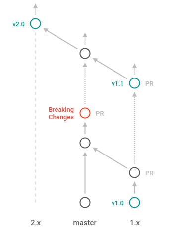

* [Branches](#Branches)
* [Tasks](#Tasks)

## Branches
New major versions of the application are developing on the `master` branch. PR's with non-breaking changes can be made to the branch corresponding to the specific version. PR's with breaking changes must be made to the `master` branch.

## Tasks
**Thank you for considering contributing!** If you would like to fix a bug or propose a new feature, you can submit a Pull Request. Any PR will be welcome.