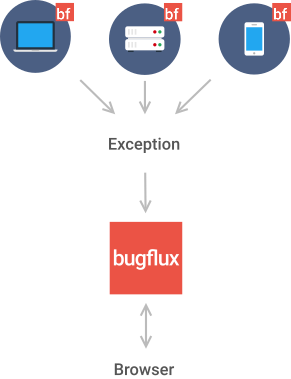

* [What is Bugflux](#What-is-Bugflux)
 * [Why should I use Bugflux](#Why-should-I-use-Bugflux)
* [How should I start](#How-should-I-start)
* [Bugflux demo](#Bugflux-demo)

## What is Bugflux?

Bugflux is an open source project aiming to help developers in collecting errors and bugs from their applications.

The main conception is shown on the picture below.

<small style="opacity: 0.6;">Icons by [webhostingmedia](http://webhostingmedia.net)</small>

Your application, system or whatever you evolves sends bug report to Bugflux. Then all collected events can be seen and managed by you and your team members via website.

### Why should I use Bugflux

Why should I collect my errors?

- Errors are in every project, sooner or later you will see them
- It is convenient to have all data gathered in one place
- One error information can be helpful when you see another similar error
- It is good to know in detail what is happening in you application
- It is fine, when you client calls to tell about a crash and you answers "We saw that, we are now working on it!"

Why should I choose Bugflux? There are many other similar systems.

- Bugflux is for everyone - no difference if you are working alone or with your company, there is no limit for team members
- Bugflux is and it will always be completely free
- Bugflux is flexible - it can be used with different servers, with different databases and both on Windows and Linux
- Bugflux is open source - you can always add your own features or modify our code

## How should I start

First of all Bugflux can be used in two ways: using [our server instance](http://app.bugflux.com/login) or hosting on your own server. For now the first option means demo version of Bugflux and should be used only to try how it works. If you really decide to use it for your projects, you should switch to option two. The table below shows differences.

Demo | Local server
--- | ---
You don't need to download Bugflux | You must download and install Bugflux
Only one project | As many projects as you wish
You can't use it for indefinite time period - we can delete your errors' data after two weeks | Your data is hold until you delete it
You can't develop or add features to Bugflux demo | You can do with Bugflux code what do you want with immediate effect

## Bugflux demo

If you don’t want to install Bugflux until you see how it works, you should try with [our demo](http://app.bugflux.com).

Send us [support@bugflux.com](mailo:support@bugflux.com) an e-mail with you project name and we will create account for you. You should receive message with link to reset your password. Then you can start using our demo, but only with one project. Everything else like error reporting and management is the same as in the local server instance.