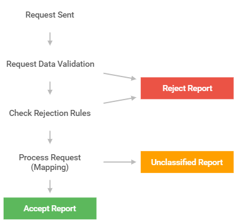

* [Collecting data](#Collecting-data)
 * [Errors identification](#Errors-identification)
 * [Other reports fields](#Other-reports-fields)
* [Sending reports](#Sending-reports)
 * [C#](#C-sharp)
 * [Node.js](#Node-js)
* [Report receiving process](#Report-receiving-process)
 * [Validation](#Validation)
 * [Rejection rules](#Rejection-rules)
 * [Finding values in the system](#Finding-values-in-the-system)
 * [Redo report](#Redo-report)


## Collecting data

The philosophy is simple. When unwanted event occurs in your application, it is sent to Bugflux server with HTTP as JSON. Bugflux server validates and processes the report and then saves it in database (or rejects it). There are for now about 10 fields which can appear in JSON message. Some of them help to identificate the error and the rest is for programmers who are developing the application (this means - for you).


### Errors identification

How does the server identificate the errors? How does it group them? Firstly it allows you to create different **projects**. Each of them has generated random short **code** (called also key), which is used to differentiate which project is the error related to. Project code must be given in every report, otherwise the report will be ignored.

Another important field which helps to identify the error is error *hash*. Its detailed meaning can be made up by you. Its default meaning is different for different languages, but its general purpose is to separate different errors or group them if they are similar. For example hash can be the SHA-256 hash computed from exception class name, file name and function name of place, where exception was thrown. It means that error is different from another error, if it is of different class and occurs in different file and in function with different name. Due to this fact, if two exceptions of class let say `InvalidOperationException` are thrown in one function, second exception thrown five lines below the first one, they will be clasified as the same error. 

Last field which classifies errors is **environment**. For now three values are possible: `Development`, `Testing` and `Production`. Even if two errors have the same hash but come from different environments, they are treated as different errors. Why this separation? We believe that this solution is better, because developers should deal with production errors in dirrerent way from for example testing errors.

So three values which differentiates errors on server's site are:

Field in JSON| Description
--- | ---
project | Generated code of project
hash | Differentiates errors in one project
environment | Environment in which error occured - `Development`, `Testing` or `Production`


### Other reports fields

Apart from mentioned fields, there are also other, which bring details connected with a paticular situation. They are presented and explained below.

Field in JSON| Description
--- | ---
version | Version of the user application.
system | Information about operating system on which application with bug was working.
language | This field can be helpful if you program is multilingual. Do not mistake this field for programming language - we assume that one project is only for one platform, known by you (so there is no need to include this information in report).
name | Name of the exception - brief overview of the situation for programmer.
stack_trace | Stack trace of the exception.
message | Message filled by the user or by programmer (log with user’s actions). This field should be helpful if it is important to reproduce steps just before the exception occured.
client_id | Id of the application instance (client of Bugflux), or of the user who is running it. It is mainly used to determine, how many clients met given error.

All fields above excluding message are **required**. 

JSON Message with all ten mentioned fields sent to Bugflux server is called report. Every project has many errors, and every error has many reports.


## Sending reports

Althought there are only few fields to fill, you probably are not very happy if you think that all of them should be acquired (for example user's operating system). What is more they should be converted to JSON and send with HTTP to server. But don't be sad, [Bugflux provides few libraries for popular languages](https://github.com/bugflux-com?q=lib-) which do it for you. Some of their functionality is defferent, but main - gathering basic data, creating and sending JSON - is implemented by all of them.

Here we present really short versions of code which sends information to server. Data which you need is project **code** and **server address**. The first can be found on management page in project's overview and the latter is the address of bugflux (same as used for accesing management page).

### C-sharp

```csharp
Config myConfig = new Config("http://bugflux.your-domain.com");
myConfig.ProjectAndClientInfo.ProjectKey = "abcd1234";

try
{
    throw new Exception("Something bad happened!");
}
catch (Exception ex)
{
    Report report = new Report(ex);
    report.Send(myConfig);
}
```

or for handling unhandled exceptions:

```csharp
Config.EnableDefaultBehaviour = true;
Config.DefaultConfig.ServerAddress = "http://bugflux.your-domain.com";
Config.DefaultConfig.ProjectAndClientInfo.ProjectKey = "abcd1234";

throw new Exception("Something bad happened!"); 
```

### Node.js

```javascript
var fs = require('fs');
var bugflux = require('bugflux');

bugflux.setDefault({
    url: 'https://bugflux.your-domain.com/',
    project: 'Your-project-key',
});

fs.readFile('/etc/passwd', function(err, data) {
    if(err) bugflux.send(err);

    // ...
});
```

or for handling unhandled exceptions:


```javascript
var bugflux = require('bugflux');

bugflux.setDefault({
    url: 'https://bugflux.your-domain.com/',
    project: 'Your-project-key',
});

throw new Error();
```

## Report receiving process

The process of report analyse has few steps. The are described below.



### Validation

The first step is of cource validation. Server checks whether JSON contains all required fields. It also checks if they are in proper format (for example they must be strings) and contains only allowed characters. Detailed requirements concerning JSON fields are in [API](/api/v1/errors.html). What is important, if `project` field contains unknown code, the report is rejected. The same happens if `environment` is not in the system (it is different from `Development`, `Testing` or `Production`).


### Rejection rules

When data is validated, and project which report is related to is recognised, server checks if there is at least one rejection rule affects the report. Rejection rule is a set of regexp patterns, each assigned to one field. If error report meet all defined patterns (patterns are combined using **and** condition) then report will be rejected. For example if pattern for version field equals "^1\\.." and pattern for environment equals "Development" then reports which version starts with string "1." (like "1.0", "1.8.3") **and** environment contains word "Development" they all will be discarded.

### Mappings

If no rejection rule meets the report, next step is finding some received fields values in the system. The table below show what happens if value is not found in the system. For other fields there is no need to find values in the system, because they are just saved as they were received.

Field | What happens if given value doesn't exist in the system
--- | ---
project | Report rejected
hash | New error is created
environment | Report rejected
version | New version is created
system | Tried to be found in mappings, if not then the report is saved in flat form and is shown in unclassified reports
language | Tried to be found in mappings, if not then the report is saved in flat form and is shown in unclassified reports

Mappings mentioned in the table are kind of projection of one value into another one. The first value is a content of given field (model) and the second value exists in the systems. The mappings says that first value should be treated in the system as the second value, because they are in fact the same value. For example if "Win10 Home" is mapped into "Windows 10" in the context of operating system field, it means that if report system field equals "Win10 Home" string it is dealt as "Windows 10".

### Redo report

Reports which are unclassified - no mappings were found for one or more of their fields - can be redone. This means that the system will try to find values for them again. You can define mapping and then redo unclassified report so it can be moved to normal, regular reports, not be stuck in unclassified (flat) reports.